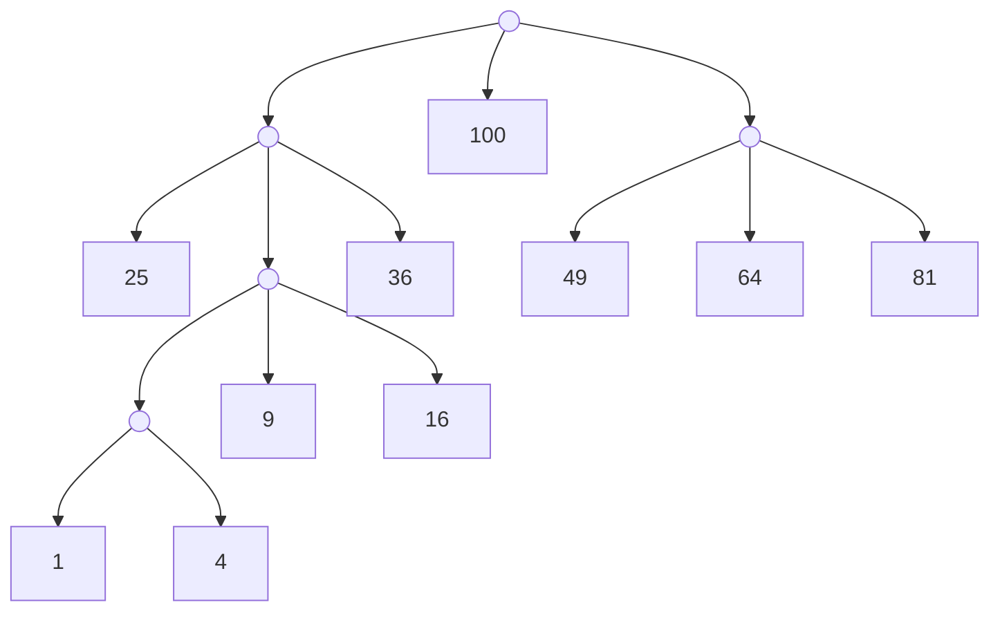

# 第五章书面作业

## 1

> 证明：判断以下叙述是否成立，并给出证明，若不成立，给出反例：
>
> 已知先序遍历序列和后序遍历序列可以确定唯一一棵二叉树。

不成立。

考虑先序遍历序列 `1 2` 与后序遍历序列 `2 1`，可确定两个二叉树：

```
  1         1
 /     与     \
2              2
```

它们的先序遍历序列与后序遍历序列满足条件。

## 2

> 在一棵表示有序集 S 的无重复元素二叉搜索树中，任意一条从根到叶子结点的路径将S分为 3 个部分：在该路径左边结点中的元素组成的集合 S1；在该路径上的结点中的元素组成的集合 S2；在该路径右边结点中的元素组成的集合 S3。S = S1∪S2∪S3。若对于任意的a∈S1，b∈S2，c∈S3，判断以下表达式是否总是成立，若成立，简要叙述理由，若不成立，给出反例：

### 1)

> a<b

考虑 a 与 b 的最近公共祖先（LCA） u，因为 S 是 b 到根的路径，所以可知 u 在 S 上。因此， a 在 u 的左子树内，b 在 u 的右子树内。

由无重复元素二叉搜索树的性质，知 a < b。成立。

### 2)

> b<c

成立。证明同 1)。

### 3)

> a<c

由 a<b 和 b<c 立刻得到 a<c 。成立。

## 3

> 设计一种算法，判断一颗二叉树的对称性（二叉树对称性即树中对称的节点val 值相同）。

只需判断左右子树是否互为镜像，递归即可。

```cpp
bool isMirror(Node *u, Node *v) {
  if (u == NULL || v == NULL) return u == v;
  if (u -> val != v -> val) return false;
  return isMirror(u -> left_child, v -> right_child) && isMirror(u -> right_child, v -> left_child);
}

bool isSymmetric(Node *u) {
  if (u == NULL) return true;
  return isMirror(u -> left_child, v -> right_child);
}
```

## 4

> 设计一种算法，检查一个长度为 m(m>0)的 int 数组是否为一个**大顶堆**。

只需判断每一对父子关系中，是否有父亲 ≥ 儿子即可。

```cpp
bool isHeap(int *a, int m) {
  for (int i = 1; i < m; ++i) if (a[i] > a[(i-1)/2]) return false;
  return true;
}
```

## 5

> 对于一组权$W_0, W_1,…, W_{n−1}$，说明怎么构造一个具有最小带权外部路径长度的扩充 $k$ 叉树。

仿照构造 Huffman 树的方式。唯一的区别在于执行最后一步时，优先队列中剩余的权可能不到 $k$ 。为了解决这个问题，在算法的一开始需要把 $(n-1) \bmod (k-1)$ 个值为 $0$ 的虚拟权值放入优先队列中。

把这些权全部放到一个优先队列中，每次取出最小的 $k$ 个权 $w_0, ..., w_{k-1}$，并创建一个新的节点 $u$ ，让权 $w_0, ..., w_{k-1}$ 对应的子树 $W_0, ..., W_{k-1}$ 成为 $u$ 的子树，并把 $u$ 的权 $w_u$ 设为 $w_0 + ... + w_{k-1}$ 再放入优先队列中，并循环，直到优先队列中只剩下 1 个节点。剩下的这个节点对应的 $k$ 叉树即为答案。

> 试对权集 1,4,9,16,25,36,49,64,81,100 来具体构造一个这样的扩充三叉树。

- 一共有 $10$ 个数， $(10-1) \bmod (3-1) = 1$，故需额外插入一个 $0$。此时优先队列中的数为 $\{0, 1, 4, 9, 16, 25, 36, 49, 64, 81, 100\}$。

- 取出 $0, 1, 4$，将其和 $5$ 放回，此时优先队列中的数为 $\{5, 9, 16, 25, 36, 49, 64, 81, 100\}$。连边

  ```
  5-->1
  5-->4
  ```

- 取出 $5, 9, 16$，将其和 $30$ 放回，此时优先队列中的数为 $\{25, 30, 36, 49, 64, 81, 100\}$。连边

  ```
  30-->5
  30-->9
  30-->16
  ```

- 取出 $25, 30, 36$，将其和 $91$ 放回，此时优先队列中的数为 $\{49, 64, 81, 91, 100\}$。连边

  ```
  91-->25
  91-->30
  91-->36
  ```

- 取出 $49, 64, 81$，将其和 $194$ 放回，此时优先队列中的数为 $\{91, 100, 194\}$。连边

  ```
  194-->49
  194-->64
  194-->81
  ```

- 取出 $91, 100, 194$，将其和 $385$ 放回，得到答案。连边

  ```
  385-->91
  385-->100
  385-->194
  ```

最终得到的图为：



## 6

> 给定结点类型为 BinaryTreeNode 的 3 个指针 p、q、rt,假设 rt↑为根结点，求距离结点p↑和结点 q↑最近的这两个结点的共同祖先结点。

首先得到结点p↑和结点 q↑到根结点rt↑的距离（深度）：

```cpp
template <typename T>
int getDepth(BinaryTreeNode<T> *p, BinaryTreeNode<T> *rt) {
  int dep = 0;
  for (; p != rt; p = p->Parent()) dep++;
  return dep;
}
```

那么结点p↑和结点 q↑到根结点rt↑的距离（深度）就分别为 `getDepth(p, rt)` 与 `getDepth(q, rt)`。

求LCA的过程如下，正确性是显然的（反证法）：

1. 先通过把结点p↑和结点 q↑上移，调整到同一深度。
2. 直到结点p↑和结点 q↑相等之前，不断将它们同时上移1个节点。
3. 此时结点p↑和结点 q↑相等，值即为LCA。

具体代码如下：

```cpp
template <typename T>
int getLCA(BinaryTreeNode<T> *p, BinaryTreeNode<T> *q, BinaryTreeNode<T> *rt) {
  int dp = getDepth(p, rt), dq = getDepth(q, rt);
  if (dp < dq) swap(p, q);
  for (; dp > dq; dp--) p = p -> Parent();
  while (p != q) {
    p = p -> Parent();
    q = q -> Parent();
  }
  return p;
}
```