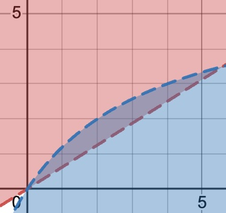
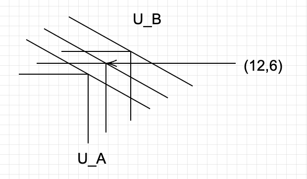

经济学原理第一次作业
====================

1.
--

> （偏好与选择）已知张三的效用函数为 $U = X^{\alpha} + Y^{\alpha}$，参数 $\alpha > 0$。求 $X = 10, Y = 5$ 时的边际替代率 $MRS_{XY}$。

由定义。
$$
MRS_{XY} = \frac{\partial U / \partial X}{\partial U / \partial Y} = \frac{\alpha 10^{\alpha-1}}{\alpha 5^{\alpha-1}} = \boxed{2^{\alpha - 1}}
$$

2.
--

> （交换、分工与货币）荒岛上只有鲁滨逊和星期五两个人，他们可以通过劳动摘到椰子或者捕鱼。假定鲁滨逊只捕鱼的话每天最多能捕 10 条鱼，只摘椰子的话最多能摘 5 个。星期五只捕鱼的话每天最多能捕 8 条鱼，只摘椰子的话最多能摘 12 个。（假设两人的生产可能性边界都是线性的，且鱼和椰子树都是整数，即鲁滨逊少捕 2 条鱼就可以多摘 1 个椰子，而星期五少捕 2 条鱼就可以多摘 3 个椰子）。
>
> 两人的效用函数分别如下：假设X为鱼的数量，Y为椰子的数量，
>
> 鲁滨逊的效用函数为: U = X + 1.6Y
>
> 星期五的效用函数为: U = XY

### (1)

> 假设两人无法进行交易，此时求他们每个人的最优选择。（注意 X， Y 都只能取整数）。

计算可得，鲁滨逊的生产可能性边界上的效用函数 U 的值为：

| X    | Y    | U = X + 1.6Y       |
| ---- | ---- | ------------------ |
| 10   | 0    | **10（此时最大）** |
| 8    | 1    | 9.6                |
| 6    | 2    | 9.2                |
| 4    | 3    | 8.8                |
| 2    | 4    | 8.4                |
| 0    | 5    | 8                  |

星期五的生产可能性边界上的效用函数 U 的值为：

| X    | Y    | Z = XY             |
| ---- | ---- | ------------------ |
| 8    | 0    | 0                  |
| 7    | 1    | 7                  |
| 6    | 3    | 18                 |
| 5    | 4    | 20                 |
| 4    | 6    | **24（此时最大）** |
| 3    | 7    | 21                 |
| 2    | 9    | 18                 |
| 1    | 10   | 10                 |
| 0    | 12   | 0                  |

因此，鲁滨逊的最优选择是 $(X,Y) = (10, 0)$，星期五的最优选择是 $(X,Y) = (4,6)$（X为鱼的数量，Y为椰子的数量）。

### (2)

> 假设两人在劳动时选择了（1）中的最优选择，然后两人碰头进行交易。求可能的交易结果以及此时椰子和鱼的价格。（假设只有两个人在交易后的效用都严格大于交易前的效用，此时交易才会发生。）（此处价格指的是鱼和椰子的相对价格。）

假设交易过后，鲁滨逊的 $(X',Y') = (10 - \Delta X, 0 + \Delta Y)$， 星期五的 $(X',Y') = (4+\Delta X, 6 - \Delta Y)$，则 $\Delta X, \Delta Y$ 为正整数，且需要满足：
$$
\begin{cases}
	-\Delta X + 1.6\Delta Y > 0 \\
	(4+\Delta X)(6-\Delta Y) > 24
\end{cases}
$$
考虑其函数图像的相交部分：

解得 $(\Delta X, \Delta Y) = (1,1)或(3,2)$。

所以，可能的交易结果为：

1. 鲁滨逊用 $1$ 个鱼换了 $1$ 个椰子。此时的相对价格（鱼/椰子）为 $1$ 。
2. 鲁滨逊用 $3$ 个鱼换了 $2$ 个椰子。此时的相对价格（鱼/椰子）为 $1.5$ 。

### (3)

> 假设两人在劳动时选择了（1）中的最优选择，此时岛上又来了罗宾斯，他愿意以 1:1 的比例交易鱼和椰子（数量不限）。求鲁滨逊和星期五此时的最优选择。

此时，设最后鲁滨逊的组合为 $(X_1, Y_1)$ ，星期五的组合为 $(X_2, Y_2)$。

假设鲁滨逊和星期五不进行交易。

考虑鲁滨逊的决策。他在 $\Delta X + \Delta Y = 0$ 的前提下，要最大化 $X + 1.6 Y$。换句话说，要最大化 $\Delta X + 1.6\Delta Y = 0.6 \Delta Y$。很明显，鲁滨逊只需要最大化 $\Delta Y$ 即可。此时他的最优选择为 $(X_1, Y_1) = (0, 10)$。

考虑星期五的决策。他在 $\Delta X + \Delta Y = 0$的前提下，要最大化

$$
\begin{aligned}
(4+\Delta X)(6 + \Delta Y) - 24 = 2\Delta X - \Delta X^2 = 1-(1-\Delta X)^2
\end{aligned}
$$

此时当 $\Delta X > 0$ 时有【略，原因见下】

> 作业第2题的第3小问因为题目出的有些歧义，所以第3小问就不用写了
>
> *——助教*

3.
--

> （消费者选择与需求曲线）假设一个双人间宿舍住着 A、B 两个同学，面对两种商品：辣条（用 x 表示）和可乐（用 y 表示）。A 同学的效用函数为 $U_A = \min(\frac{x}{2}, y)$ ，这一效用函数形式被称作 Leontief 效用函数，此时两种商品对 A 来说是完全互补关系。B 同学的效用函数为线性形式 $U_B = x + 2y$ ，此时两种商品对 B 来说是完全替代关系
>
> 为了理解完全替代和完全互补的含义，请考虑以下场景：

### (1)

> 假设 A 同学拿着 10 元钱去超市买辣条和可乐，辣条的市场价格 $p_x = 1$ ，可乐的市场价格 $p_y = 3$ ，假设 A 同学想让自己的效用最大，则 A 同学最终购买辣条和可乐的量是多少？

显然，当 $xp_x + yp_y \le 10$时，由 $p_x, p_y > 0$ 可知，当 $U_A$ 最大时， $U_A = \min(\frac{x}{2}, y) = \frac{x}{2} = y$：

解
$$
\begin{cases}
	xp_x + yp_y = 10 \\
	\frac{x}{2} = y
\end{cases}
$$
得 $(x, y) = (4, 2)$。

### (2)

> 将(1)中的 A 同学换成 B 同学，B 同学最终购买辣条和可乐的量是多少？

相当于求 $x + 3y \le 10$ 时 $U_B = x + 2y$ 的最大值。
$$
U_B = x + 2y = (x + 3y) - y \le 10 - y \le 10
$$
等号当 $y = 0, x = 10$ 时取到。

### (3)

> (交换、分工与货币)假设 A、B 两个人在宿舍里屯了 20 袋辣条和 10 瓶可乐，除此之外没有别的食物。一天深夜里，A、B 两人都饥肠辘辘，与此同时，宿舍深夜门禁导致他们不能出门买其他食物。因此理性的他们只能分配这些现有的辣条和可乐(Hint:可以用埃奇沃思盒分析下面的题目)。
>
> (3) 假设 A 拥有 8 袋辣条、4 瓶可乐，剩下都由 B 拥有，如果双方可以交换，且不存在任何的交易成本，则理性的 A、B 二人交换后，A 拥有多少辣条和可乐?

由题意，$(x_A, y_A) = (8, 4)$，$(x_B, y_B) = (12, 6)$：

如图，显然任何使 $U_A$ 增加的交易都会使得 $U_B$ 减小，反之亦然。

所以，交换后，$(x_A', y_A') = (x_A, y_A) = (8, 4)$，$(x_B', y_B') = (x_B, y_B) = (12, 6)$。

---

另外，也可以用数学语言进行证明。

因为 A、B 都理性，所以在交易后的 $U'_A \ge U_A$，因为开始时$x_A = \frac{y_A}{2}$，故 $x'_A-x_A \ge 0, y_A'-y_A \ge 0$。

又因为 $B$ 理性，故 $U_B' \ge U_B$，即 $(x_B' - x_B) + (y_B' - y_B) \ge 0$。

又因为交易在两者之间进行，所以 $(x'_A-x_A) = -(x_B' - x_B)$，$(y_A'-y_A) = -(y_B' - y_B)$。

所以，有
$$
0 \le (x_B' - x_B) + (y_B' - y_B) = - (x'_A-x_A) - (y_B' - y_B) \le 0
$$
因此，交换后，$(x_A', y_A') = (x_A, y_A) = (8, 4)$，$(x_B', y_B') = (x_B, y_B) = (12, 6)$。

### (4)

> 假设 A 拥有 8 袋辣条、6 瓶可乐，剩下都由 B 拥有，如果双方可以交 换，且不存在任何的交易成本，最终理性的 A、B 二人交换后，A 可能拥有多少辣条和可乐?(Hint:最终答案是一个区间)

显然，A 最后拥有的 $(x_A', y_A')$ 满足 $\frac{x'_A}{2} = y'_A$。否则，，因为 A 是理性的，A 可以把多余的东西和 B 进行交换，甚至送给 B，这对 A 并没有损失。

因此，设 A 最后拥有的 $(x_A', y_A') = (2a, a)$。

由 $U'_A \ge U_A, U'_B \ge U_B$ 知：
$$
\begin{cases}
	U'_A = a \ge 4 \\
	U'_B = (20 - 2a) + 2(10 - a) = 40 - 4a \ge U_B = 20
\end{cases}
$$
解得 $4\le a\le 5$。

因此，A 可能拥有的 $(x_A', y_A') \in \{(x,y)\mid x = 2y, y\in[4,5]\}$。B 可能拥有的 $(x_B', y_B') \in \{(x,y)\mid x = 2y, y \in [5,6] \}$。

4.
--

> （消费者选择与需求曲线）小余前往商店购买两种商品。假设他的总收入为 $m$，两种商品的价格分别为 $p_1, p_2$ ，而他的购买量分别为$x_1, x_2$，其效用函数为：$U(x_1, x_2) = x_1 + \ln x_2$

### (1)

> 写出他面临的预算约束、消费最优化条件

预算约束为：
$$
p_1x_1 + p_2x_2 \le m
$$
消费最优化条件为：
$$
\frac{\partial U(x_1,x_2)/\partial x_1}{\partial U(x_1, x_2)/\partial x_2} \frac{\dd x_1}{\dd x_2} = -1 ，否则 x_1 = 0 或 x_2 = 0
$$

其中 $\dd x_1 / \dd x_2$ 表示 $p_1x_1 + p_2x_2 = m$ 的隐函数导数，它的值为 $-\frac{p_2}{p_1}$。

解得条件为：

1. 当 $m \ge p_1$ 时 $x_2 = \frac{p_1}{p_2}, x_1 = \frac{m}{p_1} - 1$
2. 当 $m < p_1$ 时 $x_1 = 0, x_2 = \frac{m}{p_2}$。 

### (2)

> （以下两问不考虑角点解，即小余购买的最优产品组合总是满足 $x_1$、$x_2$ 均为正）
>
> (2) 当商品 2 涨价 10%后，小余对 2 种商品的购买量如何变化？收入效应、替代效应对$x_2$ 的分别作用？

由题意，$p_2' = 1.1 p_2$

因为不考虑角点解，所以 $x_2' = \frac{p'_1}{p'_2} = \frac{10}{11}\frac{p_1}{p_2} = \frac{10}{11}x_2$ 。

故商品 1 的购买量增加了 $\frac{1}{11}$，商品 2 的购买量减少了 $\frac{1}{11}\frac{p_1}{p_2}$。

因为收入变化不影响价格 $p_1, p_2$ ，所以不影响 $x_2 = \frac{p_1}{p_2}$ ，因此**收入效应为零**。

替代效应相当于考虑当等效用曲线 $x_1 + \ln x_2 = U$ 固定时， $x_2$ 如何随该曲线的隐函数 $\frac{\dd x_1}{\dd x_2}$ 变化。

计算得
$$
\frac{\dd x_1}{\dd x_2} = -\frac{1}{x_2}
$$
知，当商品 2 相对价格下降，即 $\frac{\dd x_1}{\dd x_2}$ 上升时， $x_2$ 上升。——**这是替代效应**。

### (3)

> 写出小余选择的商品 1 最优购买量$x_1^*$ (Hint: $x_1$ 是有关 $m, p_1, p_2$ 的函数)

因为不考虑角点解，由(1)知：
$$
x_1^* = \frac{m}{p_1} - 1
$$
